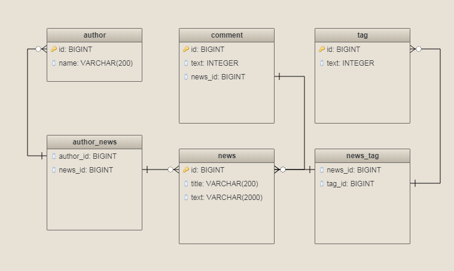

Service allows us to compare different sql queries 
 be able to benchmark the performance of its versions.
 Provide information:
  * execution time in nanoseconds
  * database version 
  * result of explain query

Database provided from [Testcontainers](https://github.com/testcontainers/testcontainers-java)

**Prerequisites:**

🐳 Docker version should be at least 1.6.0
 
🐳 Docker environment should have more than 2GB free disk space

**DB schema:**    

**API example:**

    POST http://{{host}}:8080/analyze

request:

    {  
      "queries":[  
            "select * from news",
            "select * from author"
        ]
     }

response:

    [
         {
             "time": 6455100,
             "database": "mariadb:10.3.6",
             "query": "select * from news",
             "explain": "id : 1; select_type : SIMPLE; table : news; type : ALL; possible_keys : null; key : null; key_len : null; ref : null; rows : 3; Extra : ; "
         },
         {
            "time": 6390500,
            "database": "mariadb:10.3.6",
            "query": "select * from author",
            "explain": "id : 1; select_type : SIMPLE; table : author; type : index; possible_keys : null; key : author_name_uindex; key_len : 202; ref : null; rows : 3; Extra : Using index; "
         },
         {
            "time": 2399800,
            "database": "mysql:5.7.22",
            "query": "select * from news",
            "explain": "id : 1; select_type : SIMPLE; table : news; partitions : null; type : ALL; possible_keys : null; key : null; key_len : null; ref : null; rows : 1; filtered : 100.00; Extra : null; "
         },
         {
            "time": 1813100,
            "database": "mysql:5.7.22",
            "query": "select * from author",
            "explain": "id : 1; select_type : SIMPLE; table : author; partitions : null; type : index; possible_keys : null; key : author_name_uindex; key_len : 202; ref : null; rows : 1; filtered : 100.00; Extra : Using index; "
          },
         {
            "time": 4873100,
            "database": "postgres:9.6.8",
            "query": "select * from news",
            "explain": "QUERY PLAN : Seq Scan on news  (cost=0.00..10.80 rows=80 width=942); "
         },
         {
            "time": 3185300,
            "database": "postgres:9.6.8",
            "query": "select * from author",
            "explain": "QUERY PLAN : Seq Scan on author  (cost=0.00..11.70 rows=170 width=426); "
         }
    ]
    
    
**Add new db:**

* implements com.abc.performance.container.ContainerResolver
* add %DB_NAME% to com.abc.performance.domain.Database
* add new folder %DB_NAME% with init.sql
